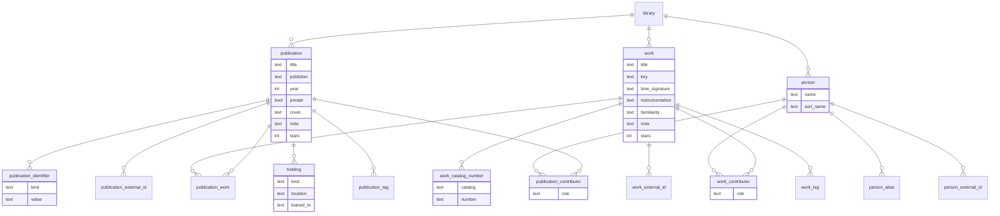

# scorarium data model

## Overview

**Libraries** contain **publications**, which contain **works**. A **holding** is an instance of a
**publication** that a user owns, either digitally or physically. A **work** is one of the works
contained in the **publication**. **Works** and **holdings** do not exist alone - they're always
contained by at least one **publication**.



## Storage layout

Scorarium's persistent state lives in two places: a configuration file and a data directory.

The **configuration file** holds deployment details: the bind address, the path to the data
directory, etc. It holds no secrets (the login password lives in the database). The application
reads it and never writes it.

The **data directory** holds what the application manages:

```
data/
    scorarium.db
    art/
        <filename>
    assets/
        <filename>
```

* `scorarium.db` is a single SQLite database containing every table in this document, for all
  libraries.
* `art/` is a flat directory holding cover art images, fetched during import or supplied by the user
  (uploaded, or fetched once from a user-provided URL - never hotlinked). Files are named by the
  application, keyed by publication; paths are stored in the database relative to `art/`. Cover art
  is optional: publications without it render a generated placeholder.
* `assets/` is a flat directory holding the files behind digital holdings. Scorarium names each file
  itself - derived from the publication's title and author/composer, with a counter to uniquify and
  the extension from the uploaded file; user-provided filenames are discarded. Paths are stored in
  the database relative to `assets/`.

## Entities

### library

A named container of publications.

* `id`: integer primary key
* `name`: text

### publication

The edition-level record; the root of existence.

* `id`: integer primary key
* `library_id`: references library
* `title`: text
* `publisher`: text, nullable
* `year`: integer, nullable
* `private`: boolean, default false; hides the publication from logged-out visitors
* `cover`: text, nullable; cover art image path relative to `art/`
* `note`: text, nullable; freeform, edited in place, no history
* `stars`: integer 1-5, nullable; null means unrated

### publication_identifier

The numbers printed on a publication to identify it. Publications can have multiple identifiers.

* `id`: integer primary key
* `publication_id`: references publication
* `kind`: text, one of `isbn`, `ismn`, `publisher_number`, `plate_number`
* `value`: text, the normalized form

Identifiers are normalized at entry and only the normalized form is stored. `isbn` normalizes to
hyphenated ISBN-13 using the ISBN agency's range table as embedded in the `isbn` crate. `ismn`
normalizes to the hyphenated `979-0` form, expanding the legacy `M-` prefix; its registrant ranges
are fixed by the standard. `publisher_number` and `plate_number` are trimmed and uppercased. An
identifier that fails validation or whose ISBN range is not in the embedded table is rejected at
entry.

Unique on (`publication_id`, `kind`, `value`): a volume printing both ISBN-10 and ISBN-13 has one
row, since both normalize to the same value. Identifiers are deliberately not unique across
publications (publishers reuse ISBNs, and volumes of a set sometimes share one); the duplicate check
at import time is a lookup on `value` that warns, not a constraint.

### work

An individual piece: a single nocturne, a sonata (a work includes all movements). Work identity is
resolved at import time: entry fields suggest existing works, and imported contents entries are
matched against existing works (catalog numbers are the strongest signal) for confirmation before
new rows are created. Residual duplicates can still arise and are cleaned up by merging, a future
admin operation whose mechanics are deliberately unspecified for now. Every work is contained in at
least one publication; deletion (below) maintains the invariant.

* `id`: integer primary key
* `library_id`: references library
* `title`: text
* `key`: text, nullable
* `time_signature`: text, nullable
* `instrumentation`: text, nullable
* `familiarity`: text, nullable, CHECK one of `want-to-learn`, `learning`, `learned`, `memorized`,
  `sight-read`, `read`
* `note`: text, nullable
* `stars`: integer 1-5, nullable

### work_catalog_number

Catalog numbers a work is known by. A work can carry several (Mikrokosmos is both Sz. 107 and BB
105); most carry one; folk pieces carry none. Structured rather than freeform because (`catalog`,
`number`) equality is the strongest match signal when deciding whether an imported contents entry is
a work the library already has.

* `id`: integer primary key
* `work_id`: references work
* `catalog`: text, the label as customarily written: `Op`, `BWV`, `K`, `Sz`, `WoO`, ...
* `number`: text, with `/` separating sub-numbers: Op. 27 No. 2 is (`Op`, `27/2`)

Unique on (`work_id`, `catalog`, `number`), which makes enrichment idempotent. Users enter one
number as printed; parsing into (`catalog`, `number`) happens at the input boundary. Enrichment from
metadata sources may add more. There is deliberately no record of which numbers were user-entered
versus enriched.

### publication_work

This table identifies which publications contain what works.

* `id`: integer primary key
* `publication_id`: references publication
* `work_id`: references work

Unique on the pair. Unordered: contents display grouped by composer for mixed anthologies, then
natural-sorted by catalog number with title as the tie-break; works with no catalog number follow
the numbered ones, sorted by title. This is not table-of-contents order, but sub-numbers keep
numbered collections in printed order (Mikrokosmos No. 97 is `Sz 107/97`).

### person

A composer, editor, arranger, or any other contributor. First-class, with identity resolved at
import time like works: matched by name and alias against existing persons before new rows are
created. Residual duplicates ("Rachmaninoff" and "Rachmaninov" from two imports) can still arise and
are cleaned up by the same future admin merge operation as works.

* `id`: integer primary key
* `library_id`: references library
* `name`: text, the display form
* `sort_name`: text, the form that sorts by surname ("Satie, Erik"). Filled at import time by
  heuristics and API lookups; the user doesn't enter the same name twice - that'd be silly.

### person_alias

**TODO:** I'm uncertain I need this - it seems as though I could use auto-complete like suggestions
on the name fields to eliminate duplicates?

Alternate spellings and transliterations ("Rachmaninov", "Tschaikowsky"). The search index matches
aliases, so any known spelling finds the person.

* `id`: integer primary key
* `person_id`: references person
* `alias`: text

### publication_external_id, person_external_id, and work_external_id

Typed identifiers linking a publication, person, or work to external databases, enabling enrichment
and pages that link to other sites. For publications they record which source record an import
resolved to (an Open Library edition, a K10plus PPN), so enrichment can be retried without
re-searching and re-picking among editions.

* `id`: integer primary key
* `publication_id` / `person_id` / `work_id`: references the parent
* `kind`: text: `wikidata`, `musicbrainz`, `imslp`, `gnd` for persons and works; `openlibrary`,
  `k10plus`, `dnb`, `harvard`, `loc` for publications (non exhaustive)
* `value`: text, the external identifier

Unique on (parent, `kind`, `value`).

### publication_contributor and work_contributor

Who did what, on the publication ("edited by") and on the work ("composed by"). Roles are text with
conventional values: `composer`, `editor`, `arranger`, `translator`, ...

* `id`: integer primary key
* `publication_id` / `work_id`: references the parent
* `person_id`: references person
* `role`: text

### holding

One copy of a publication that you possess, physical or digital. Every publication has at least one
holding: creating a publication creates its first holding, and deleting a publication's last holding
deletes the publication (which in turn deletes its orphaned works). Like the work-in-a-publication
invariant, this is enforced by the application, not the database.

* `id`: integer primary key
* `publication_id`: references publication
* `kind`: text, CHECK one of `physical`, `digital`
* `location`: text, nullable for physical, required for digital (application-enforced); freeform for
  physical ("piano bench"), a filepath relative to `assets/` for digital holdings
* `loaned_to`: text, nullable; a name while this copy is lent out, null otherwise. On the holding
  rather than the publication so lending one of two copies is representable. Mostly meaningful for
  physical copies, but not enforced

### publication_tag and work_tag

Plain-text tags. No tag registry is necessary; the set of distinct tags in use is the vocabulary,
autocomplete suggests from the union of both tables, and the user-facing concept provided by the UI
is simply "tags".

* `id`: integer primary key
* `publication_id` / `work_id`: references the parent
* `tag`: text

Unique on the pair; indexed on `tag` for filtering and autocomplete.

### login_session

A login session; the stored form of the cookie that keeps the user logged in. Stored in the database
so restarts do not log the user out.

* `id`: integer primary key
* `token_hash`: hash of the session token (the token itself is never stored)
* `created_at`, `expires_at`: timestamps

### password

The login password, hashed with a standard password KDF; at most one row. An empty table means the
password is unclaimed, and the first login sets it. The first-to-claim race is accepted for a
single-user self-hosted deployment. There is no reset flow: the operator deletes the row and claims
again.

* `id`: integer primary key
* `password_hash`: text, the KDF output (salt and parameters included in the encoded form)

### pending_import

An import in progress, created when the user picks a lookup candidate (or chooses manual entry) on
the import page and deleted when the import is accepted or discarded, or when its library is
deleted. Pending imports sit outside the catalog: they are invisible to the public, participate in
no garbage collection, and persist only the user's entry page input. The resolved lookup candidate
and all enrichment results are ephemeral application state, re-derived after a restart. The import
design document describes the flow.

* `id`: integer primary key
* `library_id`: references library
* `query`: text, the identifier or title as typed; empty for manual entry
* `kind`: text, CHECK one of `physical`, `digital`; becomes the first holding on accept
* `file`: text, nullable; uploaded file path relative to `assets/`, required for digital
* `created_at`: timestamp

## Access control

Visible to logged-out visitors:

* libraries, publications, works, and persons, with their contributors, identifiers, catalog
  numbers, aliases, and external ids
* stars, on both publications and works
* cover art images
* the existence and kind of holdings ("one physical copy, one PDF")

Requires login:

* any and all modifications
* publications marked `private`, including their containment links: a work contained only in private
  publications is invisible to the public, as is a person contributing only to private publications
  and their works
* holding `location` and `loaned_to` values (shelf names, file paths, borrower names) and the files
  themselves
* tags, notes, and familiarity

The `private` flag lives on publications only. Everything else derives its visibility from the
publications it is reachable through, or from the field-level rules above. All access control is
enforced by the application; the database does not care.

## Deletion semantics

This is a library of publications: publications are deleted deliberately, and everything else lives
or dies by whether a publication still needs it.

Deleting a **publication** deletes its dependent rows (identifiers, external ids, holdings,
contributor links, tags, containment links), then garbage-collects:

* **works** no longer contained in any publication, along with everything on them (catalog numbers,
  contributor links, tags, external ids, familiarity, notes, stars)
* **persons** no longer referenced by any contributor link, along with their aliases and external
  ids

Works still contained in another publication survive, as do persons still credited anywhere. Garbage
collection is silent by design; the user cares about publications, not orphan management.

Deleting a publication's **last holding** deletes the publication, with everything above.

Works and persons are not deleted directly. Editing a publication's contents removes containment
links, and the same garbage collection applies; merging duplicates (a future admin operation) is the
tool for cleaning up works and persons, not deletion.

Deleting a **library** deletes everything in it.

Deleting rows never deletes **files on disk**. The assets and art directories are archives the
application adds to but never removes from.

## Search index

The single-textbox search is served by a SQLite FTS5 full-text index. The index holds one row per
searchable entity (publication, work, person), with one indexed column per field group:

* `title`: the entity's title or name
* `people`: contributor names and all their aliases (for persons, the name and aliases themselves)
* `numbers`: catalog numbers as formatted ("Op. 27 No. 2", "BWV 988") and publication identifiers in
  both printed and normalized forms
* `tags`: the entity's tags
* `familiarity`: the work's familiarity value
* `notes`: the entity's note text

Each row also records what kind of entity it describes, the entity's id, and its library, so results
can be presented by type and filtered per-library.

The index is structurally neutral about privacy; enforcing the public/private access control is an
application concern.

The index is derived data: it is kept in sync with the tables it mirrors (via triggers or
application code) and can be rebuilt from scratch at any time.

## Queries this model must be able to answer

The model is validated by checking the questions it exists to answer.

* **"Do I have the sheet music for this piece?"** Search matches the work (title, catalog number, or
  composer, via any alias or spelling); `publication_work` lists the publications containing it;
  their holdings say in what form (physical, digital, both).
* **"What is in this volume?"** - `publication_work` for the publication, works sorted by catalog
  number.
* **"What do I own by this composer?"** - resolve the name through `person_alias` to a person, then
  `work_contributor` and `publication_contributor` to their works and publications.
* **"What am I learning?" / "What can I play?"** - works filtered by `familiarity` (logged in).
* **"Where is my copy?"** - the publication's holdings' `location` values (logged in).
* **"What did I tag 'christmas'?"** - the tag link tables, publications and works together (logged
  in).
* **"Is this volume in my library already?"** - normalize the number in hand and look it up in
  `publication_identifier.normalized`; failing that, search by title.
* **"Who did I lend it to?"** - holdings with non-null `loaned_to`, joined to their publications
  (logged in).
