# scorarium import

This document describes how publications enter the library: the import flow and the metadata
enrichment behind it. The metadata sources document covers the sources themselves (what each offers,
limits, licensing); this one covers how they compose into a pipeline and what the user experiences
along the way.

## Principles

* **Create on accept.** Nothing lands in the catalog until the user reviews and accepts it; a single
  transaction then creates the publication, its identifiers, contributors, works, containment links,
  cover art, and first holding. Until that moment the import exists only as a pending import,
  invisible to the public and outside the catalog's data model, so no catalog query needs to filter
  out half-imported data.
* **One fast lookup, then a classified fan-out.** A single request resolves the user's input to a
  candidate. Enrichment fans out only after the candidate is classified (sheet music or prose book),
  and only to the sources that fit the classification: prose books never hit the music sources.
* **Only the entry page's input is durable.** What the user typed and uploaded on the entry page
  persists; the resolved lookup candidate and all enrichment results are ephemeral application
  state. A restart wipes them and retries the import from the persisted input alone.
* **Every import ends in review.** Sources are incomplete and contents data is best-effort, so
  "needs review" is the normal terminal state of every import, not an error state.
* **One form, one enrichment machinery.** The pending-import review page shares its implementation
  with the publication page's edit mode, and the enrichment pipeline serves both: the same machinery
  that fills an import also enriches an existing entry on demand.
* **Prevention over cleanup.** Imported contributors and works enter the catalog only through
  explicit acceptance, with close matches from the existing library offered at the moment of
  decision. Nothing is auto-created, and nothing (aliases included) is auto-derived from imported
  data.
* **Be polite.** Sources are queried through the backend (never the browser) with a proper
  User-Agent, per-source rate limits, caching, and a firm per-source timeout. A source that does not
  answer in time is treated as having found nothing.

## Flow overview

A pending import is created when the user picks a lookup candidate or chooses manual entry; nothing
exists while the user is still typing on the entry page.

```mermaid
stateDiagram-v2
    [*] --> importing : candidate picked
    [*] --> needs_review : manual entry, nothing to look up
    importing --> needs_review : enrichment finishes, fails, times out, or is canceled
    needs_review --> importing : user retries, or reclassifies as sheet music
    needs_review --> [*] : accept; catalog rows created in one transaction, pending import deleted
    needs_review --> [*] : discard; pending import deleted, uploaded files remain
```

The two states differ only in whether enrichment is in flight, and neither is stored: state is
derived from the enrichment tasks in application memory, so a restart returns every unreviewed
import to `importing`. (Reclassifying as a prose book is absent from the diagram because it only
cancels the music-source queries, which changes no state on its own.) The review page is reachable
in both states: while importing it fills progressively with suggestions, and once enrichment settles
it stops changing. Accepting or discarding while enrichment is still running is allowed and cancels
the outstanding queries.

Every path through enrichment (success, partial results, total failure, timeout, cancel) lands in
`needs_review`; there is no error state.

## Entry page

The entry page at `/library/{id}/import` requires login and is reached from the import button on the
library page. Its elements are a physical/digital toggle defaulting to physical, a location field (a
shelf or place for physical; a file chooser for digital, whose file the application stores under
`assets/` and names itself), an "Import more" checkbox, and a text box for a title or identifier. A
digital publication's file is at hand at import time the same way a physical volume is. The toggle
and location seed the publication's first holding, which the review page can still change.

The text box takes an identifier or a title, with different behavior per kind:

* **Identifiers.** Input that looks like an ISBN or ISMN triggers no external query until it is
  complete and valid (or the user presses enter); until then the page may show what the number
  itself reveals, such as validity, group, and structure. A complete valid identifier fires its
  lookup automatically: one request, no button.
* **Titles.** Search-as-you-type candidates, debounced a few hundred milliseconds, with a minimum
  input length before any external query. Candidates show cover art, title, and composer/author. The
  suggestion endpoint is the same search a plain form submit uses, so the page degrades to
  type-submit-and-pick without JavaScript.

Local matches are offered before external ones. A complete identifier is first looked up in
`publication_identifier.normalized`, and on a hit the page offers to add a holding to the existing
publication instead of importing a duplicate. The toggle and file are already filled in, so
accepting the offer creates the holding directly, with no pending import, no enrichment, and no
review. An import-as-new escape remains, because publishers reuse ISBNs and volumes of a set
sometimes share one. The title typeahead behaves the same way: library matches appear above the
external candidates, visually distinct, and picking one leads to the same offer.

Picking an external candidate creates the pending import and starts enrichment in the background. A
manual-entry escape hatch creates a pending import with no candidate, since there is nothing to wait
for. This is also the path when every lookup comes up empty. Either way, "Import more" decides where
the user lands: when checked, the user stays on the entry page, cleared and ready for the next
input, with the box still checked; when unchecked, the new import's review page opens. The expected
batch usage is importing several publications back to back and then working through the review
queue, so the entry page lists its own library's pending imports beneath the form, showing what was
just queued. Whatever was typed seeds the draft: a valid ISBN or ISMN as its first identifier row,
anything else as its title. Lookup, once it exists, builds on that seed rather than replacing it.

## Lookup and enrichment

The entry page's only external traffic is identification: the typeahead search or the single
identifier lookup that resolves the user's input to a candidate. Everything else in this section
runs in the `importing` state, in the background, after the user has moved on.

The initial lookup resolves the input against one primary source per input kind: Open Library for
ISBNs and title searches, K10plus for ISMNs, and DNB as the identifier fallback.

Heuristics classify the candidate as sheet music or prose book, and the user can override the
classification with a toggle on the review page; flipping it starts or cancels the music-source
fan-out. The heuristics themselves (title and contributor patterns, signals in the source records)
are an implementation concern.

Enrichment then fans out in parallel to the sources relevant for the classification. Rate limits are
per-source, so concurrent queries are still polite, and the wall-clock cost is the slowest source
rather than the sum. The tiers, with each source's details in the metadata sources document:

* **Publication metadata and contributor roles** come from K10plus, DNB, and the Library of
  Congress, on top of the initial record. Both classifications get this tier.
* **Contents** (the contained works) come from Harvard LibraryCloud, for sheet music only. Proposed
  works are matched against the existing library (catalog number equality is the strongest signal,
  then title and contributor names) to produce the close-match suggestions the review page shows.
* **Work enrichment** runs once contents arrive, for sheet music only: each proposed work is
  enriched from MusicBrainz, Wikidata, and IMSLP with keys, instrumentation, additional catalog
  numbers, and external ids. One rate-limited request per work per source makes this the slowest
  tier; a large anthology takes minutes, which the background queue model absorbs. Catalog numbers
  arriving here strengthen the contents tier's library matching. Enriching proposed works the user
  may later reject costs API calls, but the alternate catalog numbers and external links are a large
  part of the tool's search value ("BB 105" must find the volume imported as "Sz 107"), so
  enrichment runs by default rather than on request.
* **Cover art** is fetched once, held with the pending import, and written to `art/` on accept.

The pipeline has no merge policy. When sources disagree on a field, each value becomes a suggestion,
the review page presents the conflict, and the user picks. The only pipeline-level judgment is
classification, and the user can override that too.

Each source gets a firm timeout, and a source that fails or times out is treated as having found
nothing; there is no per-source outcome reporting in the UI. Enrichment as a whole is cancelable,
and every outcome lands in `needs_review`.

## Review queue

The review queue at `/review` is a logged-in, cross-library page behind a header link, built for the
batch usage above: queue several imports, then work through them. It is a derived worklist backed by
nothing but queries; there is no queue table.

The queue lists the pending imports across all libraries. Each row shows what identifies the import
(the resolved candidate's title and cover when enrichment has them in memory, otherwise the typed
query), its library, its state, and its age, and links to its review page. While `importing`, a row
also shows a progress indicator and a cancel button that stops enrichment and moves the import to
`needs_review` with whatever it has. Progress is approximate by nature: arriving contents grow the
amount of outstanding work enrichment, so the indicator communicates activity and rough completion
rather than an exact fraction.

The header link shows a count of the imports in `needs_review`. Imports still in `importing` appear
in the list but are not counted; they become actionable when enrichment settles. The entry page
shows the same list filtered to its own library.

## Review page

The review page at `/library/{id}/import/{pending_id}` requires login and is linked from the review
queue. It shares its implementation with the publication page's edit mode: the same fields, form
components, autocomplete, and close-match logic. On top of edit mode it adds a banner explaining
that accepting creates the publication, the music/book classification control, and, while enrichment
is in flight, a cancel button and progressive filling.

Progressive filling puts an arriving value directly into its field when there is no conflict, where
it is easily cleared. Conflicting values land beside the field as suggestions to pick among. A field
the user has already edited is never overwritten; late arrivals become suggestions there instead, so
manual entry always wins. Each field carries a status icon (idle, querying, filled, conflicting
suggestions), but there is no per-source reporting. Provenance is a property of pending suggestions
only; accepted values carry no record of where they came from.

Every field autocompletes from the current library: publishers, contributor names, work titles,
catalog labels, and the publication title itself, where matching an existing title doubles as an
early warning that the volume may already be cataloged.

Close matches from the library appear under fields the same way suggestions do: a contributor field
holding an imported "Rachmaninov" offers the existing "Rachmaninoff (12 works)" to use instead of
creating a new person. Rejected spellings are discarded entirely; aliases are created only by hand
on the person page. The publication itself gets the same treatment, which catches duplicates that
slipped past the entry page (a different printing's ISBN, a near-identical title): when the pending
import closely matches an existing publication, the page offers to add a holding to that publication
instead, which creates the holding and discards the pending import.

The review page edits the publication's fields and its links, plus the minimum inline fields needed
to create a newly-linked entity; anything deeper waits for the entity's own page, after accept.
Concretely, a contributor row is a name, a role, and a use-existing-or-create-new choice. A proposed
work row is a title, composer, and catalog number, editable inline; each row shows its probable
existing match and can be individually accepted, rejected, or replaced, and manual rows can be
added. The first holding's physical/digital choice and location are seeded from the entry page and
edited here like any other field. Keys, time signatures, instrumentation, aliases, and other entity
depths are not edited here: a proposed work row carries its enrichment as payload, and accepting the
row creates the work with that depth, but editing the depth happens on the work and person pages,
after accept. With live progression, rows can gain enrichment while being reviewed; late arrivals
land as row updates to inspect before accepting.

A publication can be accepted with no works at all. Contents data is scarce, so an empty works
section is a normal outcome, and works can be added later on the publication page, by hand or
through on-demand enrichment (below). Accepting commits everything in one transaction and deletes
the pending import. Discarding deletes the pending import; uploaded files remain, per the data
model's archive rule.

The page has four buttons. Save Draft stores the edits in application memory, Discard Edits restores
the form to the stored draft, Delete Draft removes the pending import, and Submit Draft accepts.
Validation runs on every view of a saved draft and on submit; save never refuses a half-filled
draft, so the user can put a session down and pick it up with the errors still marked.

## Enriching existing entries

The enrichment machinery is not import-only. Work and publication pages offer an on-demand enrich
action that runs the same per-classification fan-out for an existing entry and presents the results
inside the entity's edit mode, with the same suggestion and accept/reject affordances as import
review. This serves manually created entries, works accepted before their enrichment arrived or
after a cancel, and plain re-runs; it is also how a publication accepted without works gains its
contents, since publication-level enrichment includes the contents tier.

Re-running enrichment is safe. Publication metadata re-enriches via the `publication_external_id`
stored at accept, so the original source record is fetched again without re-searching or re-picking
among editions. The `work_catalog_number` uniqueness rule makes accepting the same catalog number
twice a no-op, and the crosswalks between the sources (Wikidata to MusicBrainz to IMSLP) let one
accepted match seed the next source's lookup.

## Restarts and durability

The pending import row persists only what the user provided on the entry page: the library, the
typed query, the physical/digital choice, the holding's location, and a timestamp. Uploaded files
are already durable on disk. Everything else (the resolved candidate, enrichment results and
per-source progress, suggestions, and unaccepted review edits) is application memory.

On restart, every unreviewed import returns to `importing`: the lookup re-resolves from the
persisted input and enrichment re-runs from the beginning. Re-resolution is deterministic for
identifiers; a title-based import may land on a different edition than originally picked, and review
is where that gets caught.

This trades two costs for simplicity. A restart re-spends rate-limited API calls on unreviewed
imports, and a review session abandoned midway is redone, which matters most for manual entry, where
every field is typed rather than fetched. The escape valve for a long manual session is accepting
early: a publication is valid with no works, and depth can be added on its own pages afterward. For
a single-user, self-hosted tool with rare restarts these costs are acceptable, and in exchange the
catalog carries no import state: the `pending_import` table (defined in the data model document) is
the entire durable footprint of the import system.
