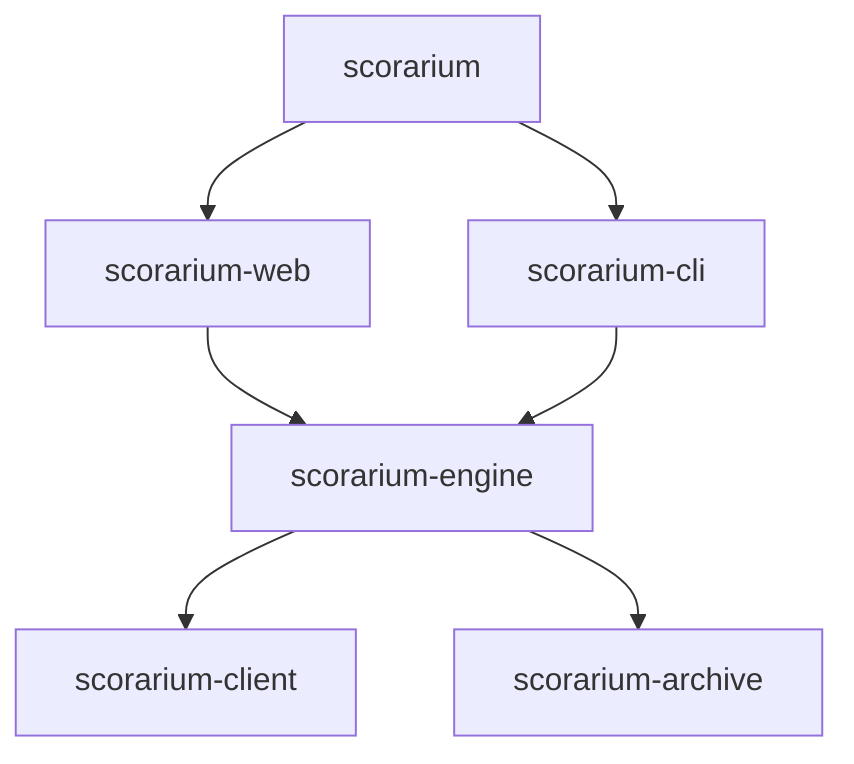

# CLI tool

## Goal

Over time, the `scorarium` and `scorarium-archive` crates have grown far too tightly coupled.
Implementation details of the forms have leaked into the archive to my dismay. Additionally, there
needs to be a much clearer flow of data when the source code is read. I get myself confused
constantly. The proliferation of similar but slightly different types hurts in this regard. There
needs to be a convention, and maybe even enforced through the use of traits.

Building a second consumer that doesn't use the web forms is a forcing function to motivate a better
API separation. Further, a CLI tool is a convenient way to test the underlying data model and
business logic.

## Use cases

This is primarily a developer tool, but it could also be used by end users to programmatically
interact with their libraries. I expect to use the CLI against an existing database concurrently
with the web server, and I expect to use it with its own demo database for testing.

It will _not_ be built against the same web API the forms use; that defeats the purpose of the tool.

## CLI REPL design

It could be one of a few types:

1. stateless, where commands are given from CLI arguments
2. TUI, where it basically replicates the web forms in the terminal
3. Menu-driven, where the user runs through nested menus to perform actions
4. REPL, where there's a DSL for interacting with the library

The statefulness implied by the demo database, and the fact that import drafts are stored in-memory,
not the database, implies that the CLI tool needs to be stateful. The TUI is most user-friendly, but
the REPL is easiest to script and utilize for testing.

The CLI will provide a REPL with a line-editing interface, command history, and ideally
tab-completion. It will be able to execute scripts from stdin. It does not need to be able to
execute one-off commands from the CLI arguments.

The following is offered as an example of what it _could_ look like, not as a specification:

```
scorarium> library list
  1  books    200 publications
  2  music    50 publications
scorarium> library create "custom"
scorarium> library rename "custom" "custom 2"
scorarium> library delete "custom 2"
scorarium> library select "books"
scorarium[books]> publication list
  1  Practical Vim
  2  Pro Git
  ...
scorarium[books]> publication list --tag reference
  ...
scorarium[books]> publication show <id or title>
  ...
scorarium[books]> search <query>
  ...
scorarium[books]> quit
```

```
scorarium[books]> import start <title or ISBN> [--physical|--digital <LOCATION>]
scorarium[books]> import list
  ...
scorarium[books]> import show 3
scorarium[books]> import accept 3
scorarium[books]> import edit 3
scorarium[books] import 3> set title "..."
scorarium[books] import 3> ...
```

It would be helpful for testing the external APIs if the REPL could provide suggestions just like an
IDE to match what the web UI does.

### Database migration

I don't want the CLI to perform a migration out from under a running server. So it should detect a
schema mismatch and exit with an error if migrations need to be applied.

### API rate limits

The CLI and server won't be able to share a rate-limited API client without a lot of work. So I
think we have to accept two concurrent API clients that could exceed the APIs limits.

We could potentially move the API cache onto disk instead of in-memory. But then I'd have to think
about cache eviction. Maybe something simple like "keep responses cached for 30 days" would be
sufficient to be useful, polite, and still allow for refreshed data.

### Script DSL

The DSL will be a flat grammar, but I think there could be an active selection that serves as a
shortcut to reduce typing for the interactive user.

The DSL needs to provide:

* Overall help, and for any given command
* Grammar tab completion
* Suggestion dropdowns
* Line editing with readline-like shortcuts (`ctrl-w` et al) and command history. Bonus points for
  fzf-style history
* Run a script from stdin with comments, quoting, and line continuations

* List libraries
* Select a library, clear a library selection
* Create, rename, and delete a library (and set its visibility)

* List publications within a library
* Search and filter publications by query and tag
* List composers and authors
* List tags

* Show a publication
* Show a work
* Show a person

* Edit a publication's title, publication, year, stars, note, and tags
* Add, change, or remove publication identifiers
* Add, change, or remove contributors
* Add and remove links
* Add, remove holdings
* Add and remove works
* Delete a publication

* Set a work's title, key, time signature, instrumentation, stars, note, and tags
* Add and remove catalog numbers, contributors, and links
* Merge potentially duplicate works together

* Edit a person's name
* Add and remove links from a person

* Start an import
* Add holdings
* List pending imports
* Show a pending import
* Edit a pending import
* Wait until enrichment is finished
* Accept the import
* Discard the import

TODO: Attempt to define a relatively complete DSL

## Architecture

I want to separate the temporal business logic out of the current web crate, but it doesn't belong
in the archive either. So there should be a new `scorarium-engine` crate with the business logic.



There will be a single `scorarium <serve|shell>` binary as a matter of convenience to the user. But
it should be extremely thin and defer to `scorarium-web` to host the server, and `scorarium-cli` for
the REPL.

### Engine API

Both the `scorarium-web` and `scorarium-cli` crates will be implemented in terms of the
`scorarium-engine`. The web and cli crates will only interact with the engine. The engine may
re-export and forward the handle types from the archive, but it will look and feel like one
consistent engine API. The exact boundary between the web, engine, and archive crates needs to be
defined still, particularly with where and what kind of validation on inputs is performed.

The engine API should provide:

* background tasks and their state
* suggestions for different fields, including conflict resolution for multiple requests providing
  suggestions for a single field.
* read/write/edit/delete

## Deviations from the current architecture

### Pending imports

Sharing the pending imports in the database, but NOT sharing the in-memory drafts is spicy. I think
it's simpler, and less error-prone if the pending imports leave the database entirely. That means a
server crash or restart loses every draft, but I'm okay with that.
